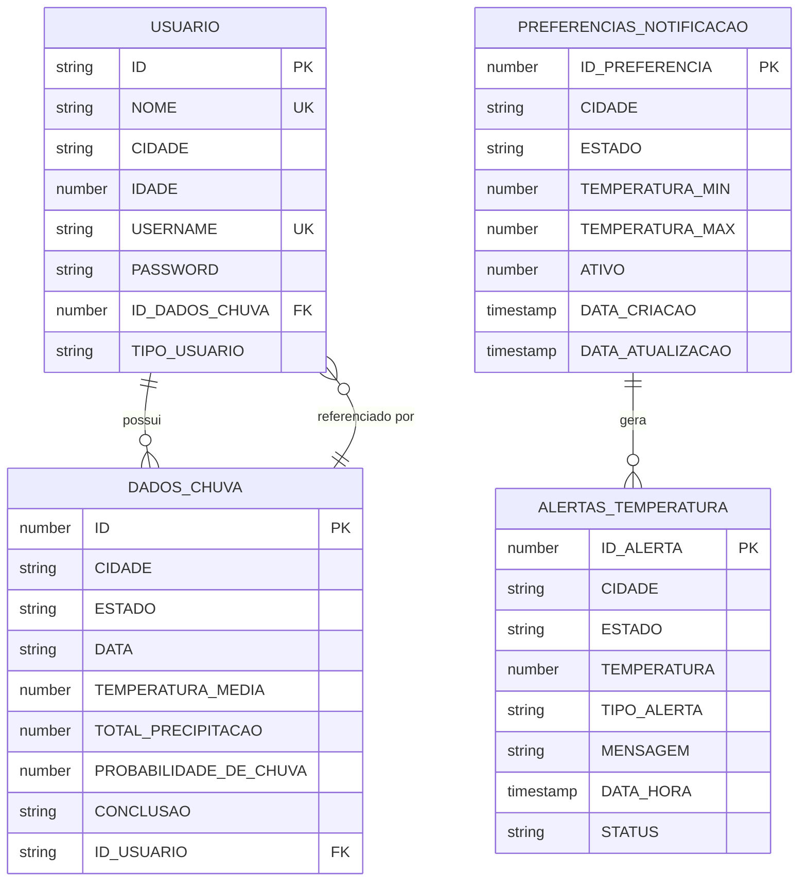

# Weather Alert API

Sistema de alerta meteorológico desenvolvido para monitorar e notificar usuários sobre condições climáticas críticas.

## Integrantes
- Ruan Lima Silva - RM558775
- Richardy Borges Santana - RM557883
- Marcos Vinicius Pereira de Oliveira - RM557252

## Requisitos Implementados

### Advanced Business Development with .NET
- ✅ API REST com boas práticas de programação/arquitetura
- ✅ Persistência em Banco de Dados relacional (Oracle)
- ✅ Relacionamento 1:N (USUARIO -> DADOS_CHUVA)
- ✅ Documentação com Swagger
- ✅ Aplicação de Razor e TagHelpers
- ✅ Uso de Migration (scripts SQL)

### Mastering Relational Database
1. **Modelagem Relacional (3FN) - 20 pontos**
   - ✅ Diagrama lógico e físico com entidades normalizadas
   - ✅ Relacionamentos bem definidos
   - ✅ Atributos normalizados

2. **Criação das Tabelas com Restrições - 10 pontos**
   - ✅ PRIMARY KEY em todas as tabelas
   - ✅ FOREIGN KEY para relacionamentos
   - ✅ NOT NULL em campos obrigatórios
   - ✅ CHECK para validações

3. **Procedures DML por Tabela - 25 pontos**
   - ✅ Procedure de inserção para cada tabela
   - ✅ Procedure de atualização para cada tabela
   - ✅ Procedure de exclusão para cada tabela
   - ✅ Dados de exemplo inseridos via procedures

4. **Funções para Retorno de Dados Processados - 10 pontos**
   - ✅ FN_CALCULAR_MEDIA_TEMPERATURA: Calcula média de temperatura por cidade
   - ✅ FN_CONTAR_ALERTAS_POR_ESTADO: Conta total de alertas por estado

5. **Blocos Anônimos com Consultas Complexas - 10 pontos**
   - ✅ Bloco 1: Análise de alertas por cidade com cursor
   - ✅ Bloco 2: Análise de preferências e alertas por estado

6. **Cursores Explícitos - 10 pontos**
   - ✅ Cursor implementado no bloco anônimo de análise de alertas
   - ✅ Uso de OPEN, FETCH, CLOSE
   - ✅ Loop para processamento dos dados

7. **Consultas SQL Complexas - 10 pontos**
   - ✅ Análise de temperatura por cidade e estado
   - ✅ Análise de preferências por faixa de temperatura
   - ✅ Análise de alertas por período do dia
   - ✅ Análise de preferências com alertas recentes
   - ✅ Análise de tendência de temperatura

## Diagrama do Banco de Dados



## Como Executar o Projeto

1. **Pré-requisitos**
   - .NET 9.0 SDK
   - Oracle Database 19c ou superior
   - Visual Studio 2022 ou VS Code

2. **Configuração do Banco de Dados**
   Execute os scripts na seguinte ordem:
   ```
   Database/Scripts/
   ├── 01_initial_setup.sql    # Criação das tabelas
   ├── 02_procedures.sql       # Procedures DML
   ├── 03_indices.sql         # Índices
   ├── 04_auditoria.sql       # Auditoria
   ├── 05_dados_exemplo.sql   # Dados iniciais
   └── 06_funcoes_e_consultas.sql  # Funções e consultas
   ```

3. **Configuração da API**
   - Clone o repositório
   - Configure a string de conexão em `appsettings.json`
   - Execute `dotnet restore`
   - Execute `dotnet run`

4. **Acessando a API**
   - Swagger UI: `https://localhost:5001/swagger`
   - Interface Web: `https://localhost:5001`

## Testes

1. **Testes Unitários**
   ```bash
   cd WeatherAlertAPI.Tests
   dotnet test
   ```

2. **Testes da API**
   - Use a collection Postman: `WeatherAlertPreferencias.postman_collection.json`
   - Ou execute os testes HTTP em `Tests/complete-api-tests.http`

## Documentação

- [Documentação da API](https://localhost:5001/swagger)
- [Collection Postman](WeatherAlertPreferencias.postman_collection.json)
- [Scripts SQL](Database/Scripts/)

## Vídeos de Demonstração

- [Demonstração Completa](link_do_video) (8 minutos)
- [Pitch do Projeto](link_do_video) (3 minutos)
